# Capital Allocation Decision Framework

This is a test article to verify Mermaid diagram rendering works correctly.

## The Five-Choice Framework

Every dollar of profit presents exactly five choices for capital allocation:

```mermaid
flowchart TD
    A[💰 Available Capital] --> B{Decision Point}
    B --> C[🏗️ Organic Growth<br/>Reinvest in Core Business]
    B --> D[🤝 Acquisitions<br/>Inorganic Growth]
    B --> E[💳 Debt Paydown<br/>Reduce Leverage]
    B --> F[💵 Dividends<br/>Return to Shareholders]
    B --> G[📈 Share Buybacks<br/>Repurchase Stock]
    
    C --> H[Higher ROIC?]
    D --> I[Accretive Deal?]
    E --> J[Optimal Capital Structure?]
    F --> K[Sustainable Yield?]
    G --> L[Below Intrinsic Value?]
    
    H -->|Yes| M[✅ Value Creation]
    H -->|No| N[❌ Value Destruction]
    I -->|Yes| M
    I -->|No| N
    J -->|Yes| M
    J -->|No| N
    K -->|Yes| M
    K -->|No| N
    L -->|Yes| M
    L -->|No| N
```



## ROIC vs Growth Matrix

The relationship between Return on Invested Capital and growth determines value creation:

```mermaid
quadrantChart
    title ROIC vs Growth Matrix
    x-axis Low Growth --> High Growth
    y-axis Low ROIC --> High ROIC
    quadrant-1 Stars (High ROIC, High Growth)
    quadrant-2 Cash Cows (High ROIC, Low Growth)
    quadrant-3 Dogs (Low ROIC, Low Growth)
    quadrant-4 Question Marks (Low ROIC, High Growth)
```

## Decision Timeline

The capital allocation process follows a structured timeline:


## Key Metrics Comparison

| Allocation Choice | Typical ROIC | Risk Level | Time Horizon | Reversibility |
|-------------------|--------------|------------|--------------|---------------|
| Organic Growth    | 15-25%       | Medium     | 2-5 years    | Low           |
| Acquisitions      | 8-20%        | High       | 3-7 years    | Very Low      |
| Debt Paydown      | 5-8%         | Low        | Immediate    | Medium        |
| Dividends         | N/A          | Low        | Ongoing      | Low           |
| Share Buybacks    | Variable     | Medium     | Immediate    | High          |

## Summary

This test demonstrates:
- ✅ Mermaid flowcharts render correctly
- ✅ Quadrant charts work for matrices
- ✅ Gantt charts show timelines
- ✅ Tables display properly
- ✅ Markdown formatting is preserved

The capital allocation framework provides a systematic approach to evaluating the five fundamental choices every CEO faces with available capital.
