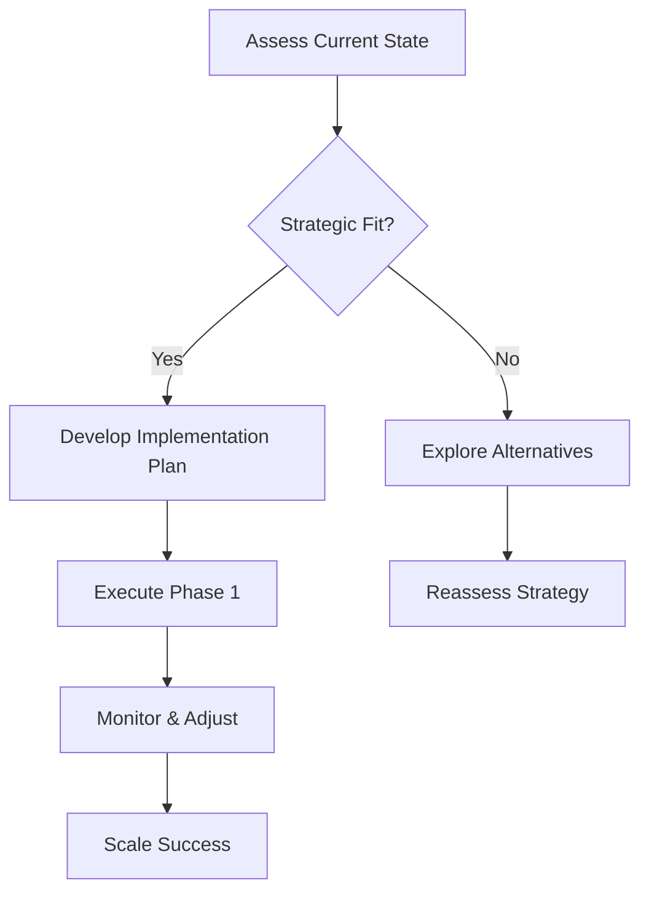

# 2.2: Crafting Your 'North Star' Metric

## Executive Summary

*[2-3 paragraphs providing a high-level overview of the lesson's key concepts and why they matter for CEOs]*

**Key Learning Objectives:**
- Understand the fundamental principles of [topic]
- Learn to apply [framework/tool] in real-world scenarios
- Develop the ability to [specific skill/capability]
- Master the art of [advanced technique]

---

## Core Principle

*[400-600 words explaining the fundamental concept, theoretical foundation, and industry context]*

### The Foundational Framework

*[Detailed explanation of the core framework or methodology]*

### Why This Matters for CEOs

*[Specific relevance to executive decision-making and leadership]*

---

## The Framework

*[600-800 words providing step-by-step methodology, decision criteria, and implementation process]*

### Decision Matrix

| Criteria | Option A | Option B | Option C |
|----------|----------|----------|----------|
| **Risk Level** | Low | Medium | High |
| **Time Horizon** | 1-2 years | 3-5 years | 5+ years |
| **Resource Requirements** | Minimal | Moderate | Significant |
| **Expected ROI** | 15-20% | 25-35% | 40%+ |

### Implementation Process

---

## Real-World Examples

*[500-700 words with 2-3 detailed company case studies, specific numbers and outcomes, lessons learned]*

### Case Study 1: [Company Name]
**Situation:** *[Brief context]*
**Action:** *[What they did]*
**Result:** *[Specific outcomes with numbers]*
**Lesson:** *[Key takeaway]*

### Case Study 2: [Company Name]
**Situation:** *[Brief context]*
**Action:** *[What they did]*
**Result:** *[Specific outcomes with numbers]*
**Lesson:** *[Key takeaway]*

---

## Common Pitfalls

*[300-400 words covering typical mistakes, warning signs, and how to avoid them]*

### The Top 5 Mistakes

1. **[Mistake 1]** - *[Description and how to avoid]*
2. **[Mistake 2]** - *[Description and how to avoid]*
3. **[Mistake 3]** - *[Description and how to avoid]*
4. **[Mistake 4]** - *[Description and how to avoid]*
5. **[Mistake 5]** - *[Description and how to avoid]*

---

## Application Exercise

*[200-300 words with practical scenario, questions for reflection, and next steps]*

### Scenario
*[Detailed business scenario for the reader to work through]*

### Reflection Questions
1. What would be your first three actions in this situation?
2. How would you measure success?
3. What are the potential second-order consequences?
4. How would you communicate this decision to stakeholders?

### Next Steps
- [ ] Assess your current situation using the framework
- [ ] Identify the top 3 areas for improvement
- [ ] Develop an action plan with specific timelines
- [ ] Set up measurement and monitoring systems

---

## Key Takeaways

*[100-150 words with 5-7 bullet points of actionable insights]*

- **[Takeaway 1]:** *[Specific, actionable insight]*
- **[Takeaway 2]:** *[Specific, actionable insight]*
- **[Takeaway 3]:** *[Specific, actionable insight]*
- **[Takeaway 4]:** *[Specific, actionable insight]*
- **[Takeaway 5]:** *[Specific, actionable insight]*
- **[Takeaway 6]:** *[Specific, actionable insight]*
- **[Takeaway 7]:** *[Specific, actionable insight]*

---

## Further Reading

### Essential Resources
- **Book:** *[Relevant book title]* by [Author]
- **Article:** *[Relevant article title]* - [Publication]
- **Case Study:** *[Harvard Business Review case or similar]*
- **Research:** *[Academic paper or industry report]*

### Advanced Topics
- Link to related lesson: [Module X.Y: Related Topic]
- External resource: [Industry report or analysis]
- Tool/Template: [Practical resource for implementation]

---

*This lesson is part of the **Investor & Market Narrative Control** domain in the Execemy Executive Education curriculum.*
