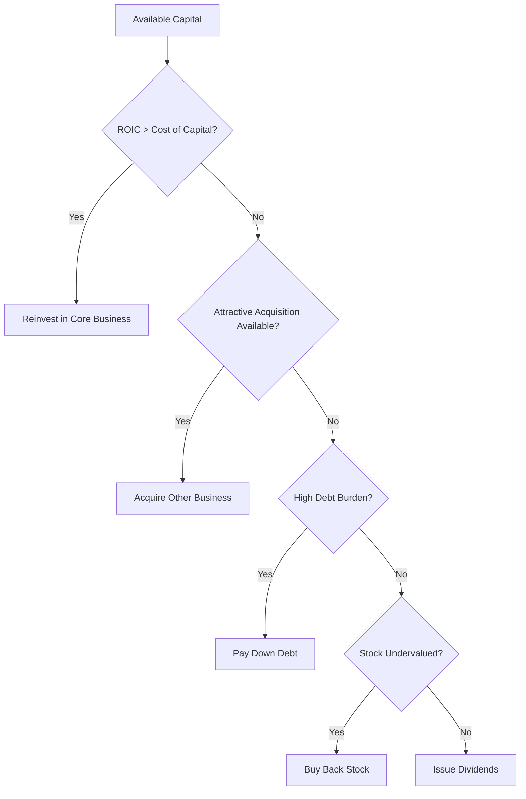

# The Five Choices: Capital Allocation Framework

## Introduction

Every dollar of profit a company generates presents a **five-way choice**. This is the foundational framework that every CEO must master to create long-term shareholder value.

## The Five Capital Allocation Options

### 1. Reinvest in the Core Business (Organic Growth)
- **Definition**: Using capital to expand existing operations, improve efficiency, or develop new products within the current business model
- **Examples**: R&D spending, new facilities, technology upgrades, market expansion
- **Key Consideration**: Return on invested capital (ROIC) vs. cost of capital

### 2. Acquire Other Businesses (Inorganic Growth)
- **Definition**: Using capital to purchase other companies or assets
- **Examples**: Strategic acquisitions, bolt-on acquisitions, vertical integration
- **Key Consideration**: Acquisition multiple vs. internal growth opportunities

### 3. Pay Down Debt
- **Definition**: Using excess cash to reduce outstanding debt obligations
- **Examples**: Early bond redemption, credit line paydown, refinancing
- **Key Consideration**: Cost of debt vs. alternative investment returns

### 4. Issue Dividends
- **Definition**: Distributing cash directly to shareholders
- **Examples**: Regular dividends, special dividends, dividend increases
- **Key Consideration**: Tax efficiency and shareholder preferences

### 5. Buy Back Stock
- **Definition**: Repurchasing company shares from the open market
- **Examples**: Open market repurchases, tender offers, accelerated share repurchase programs
- **Key Consideration**: Intrinsic value vs. market price

## The Decision Framework

## Key Principles

1. **Opportunity Cost**: Every choice eliminates the other four options
2. **Risk-Adjusted Returns**: Higher returns must compensate for higher risks
3. **Time Horizon**: Short-term vs. long-term value creation trade-offs
4. **Flexibility**: Maintaining optionality for future opportunities

## Case Study: Berkshire Hathaway's Approach

Warren Buffett's capital allocation decisions at Berkshire Hathaway demonstrate this framework in action:

- **Organic Growth**: Expanding GEICO's market share
- **Acquisitions**: Purchasing entire businesses like See's Candies
- **Debt Management**: Maintaining minimal debt levels
- **Share Repurchases**: Buying back stock when trading below intrinsic value
- **Dividends**: Historically avoiding them to reinvest at higher returns

## Conclusion

The five choices framework provides a systematic approach to capital allocation. The key is not just understanding the options, but developing the analytical skills to evaluate the risk-adjusted returns of each choice in your specific context.

## Next Steps

In the next lesson, we'll explore why **per-share value** is the only metric that truly matters when evaluating these capital allocation decisions.
