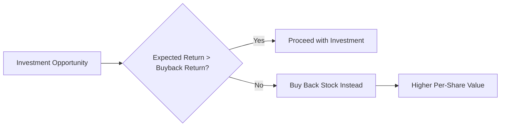

# The Primacy of Per-Share Value

## The Only Metric That Matters

While companies often focus on growth metrics like revenue, profit, or market share, there is only **one metric** that truly measures value creation for shareholders: **intrinsic value per share**.

## Why Traditional Metrics Fail

### Revenue Growth: The Vanity Metric
- **Problem**: Revenue can grow while destroying value
- **Example**: Selling products below cost increases revenue but destroys value
- **Reality Check**: Unprofitable growth is value destruction

### Profit Growth: The Incomplete Picture
- **Problem**: Absolute profit ignores the capital required to generate it
- **Example**: $100M profit requiring $2B investment vs. $50M profit requiring $200M investment
- **Reality Check**: Return on capital matters more than absolute returns

### Market Share: The Distraction
- **Problem**: Market share can be bought at unprofitable prices
- **Example**: Price wars that destroy industry profitability
- **Reality Check**: Profitable market share is what matters

## The Per-Share Value Framework

### Definition
**Intrinsic Value Per Share** = Present Value of Future Cash Flows ÷ Shares Outstanding

### Key Components

1. **Future Cash Flows**: The company's ability to generate cash over time
2. **Discount Rate**: The required return given the risk profile
3. **Share Count**: The number of shares among which value is divided

## How Decisions Impact Per-Share Value

### Scenario Analysis: $1B Available Capital

| Decision | Impact on Cash Flows | Impact on Share Count | Net Per-Share Effect |
|----------|---------------------|----------------------|---------------------|
| Organic Growth (15% ROIC) | +$150M annually | No change | **Positive** |
| Acquisition (8% ROIC) | +$80M annually | No change | **Negative** |
| Debt Paydown (5% cost) | +$50M annually | No change | **Neutral** |
| Dividends | -$1B one-time | No change | **Negative** |
| Share Buyback (20% discount) | No change | -16.7% shares | **Positive** |

## The Buyback Benchmark

### Using Share Repurchases as a Hurdle Rate

Every investment opportunity should be compared against buying back your own stock:

### Calculating Buyback Returns

**Buyback Return** = (Intrinsic Value - Market Price) ÷ Market Price

**Example**: If intrinsic value is $120 and market price is $100:
- Buyback Return = ($120 - $100) ÷ $100 = **20%**
- Any investment must exceed 20% expected return to be superior

## Common Mistakes

### 1. Earnings Per Share (EPS) Manipulation
- **Problem**: EPS can be increased through financial engineering
- **Example**: Share buybacks funded by debt at the expense of financial flexibility
- **Solution**: Focus on intrinsic value, not accounting metrics

### 2. Growth for Growth's Sake
- **Problem**: Pursuing growth that destroys per-share value
- **Example**: Acquisitions at high multiples that dilute returns
- **Solution**: Disciplined capital allocation with clear return thresholds

### 3. Ignoring Opportunity Cost
- **Problem**: Not comparing all options against the best alternative
- **Example**: Reinvesting at 8% when stock trades at 20% discount to intrinsic value
- **Solution**: Always benchmark against share repurchases

## Case Study: Apple's Capital Allocation Evolution

Apple's transformation from a growth company to a mature capital allocator:

**2012-2015: The Shift**
- Initiated dividend program
- Began aggressive share repurchase program
- Maintained disciplined approach to acquisitions

**Results**:
- Share count reduced by 35%
- Per-share value increased despite slowing revenue growth
- Demonstrated that mature companies can create value through capital allocation

## Implementation Framework

### 1. Calculate Intrinsic Value
- Build detailed cash flow models
- Apply appropriate discount rates
- Update regularly with new information

### 2. Monitor Market Price
- Track daily trading prices
- Identify periods of significant discount/premium
- Maintain buyback authorization for opportunistic repurchases

### 3. Evaluate All Decisions Through Per-Share Lens
- Investment committee reviews
- Board-level capital allocation discussions
- Regular shareholder communication on methodology

## Conclusion

The primacy of per-share value is not just an academic concept—it's the fundamental principle that should guide every capital allocation decision. Companies that consistently focus on maximizing intrinsic value per share will outperform those distracted by vanity metrics.

## Next Steps

In our next lesson, we'll explore how **opportunity cost** serves as the guiding principle for making these per-share value decisions in practice.
